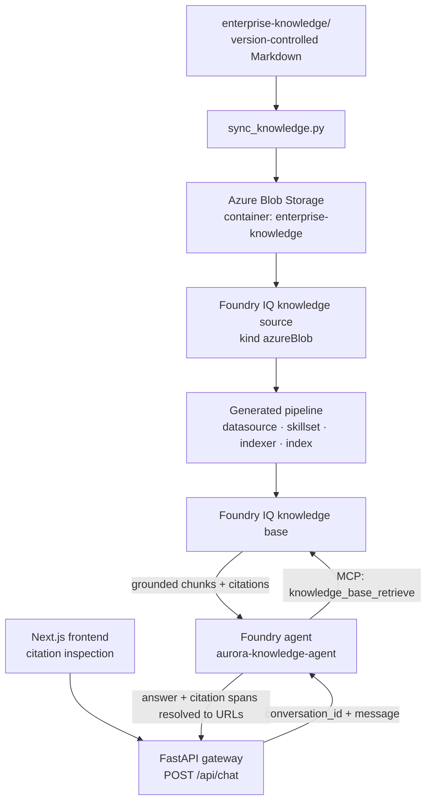

# Enterprise Knowledge Agent

Grounded answers over governed enterprise knowledge, built on **Microsoft Foundry**, **Foundry IQ** and **Azure AI Search**.

The agent answers questions that require evidence from several documents at once, cites the source of every claim, and says so plainly when the knowledge base does not contain the answer.

This is not "upload PDFs and chat with them". It is an exercise in the engineering *around* retrieval: knowledge-source architecture, ingestion, grounding, citations, agent integration, evaluation and reproducibility.

---

## Scope and honesty about status

This repository is a portfolio project, and it is explicit about what works today and what does not.

**Working end to end:** Terraform-managed Azure infrastructure, a version-controlled document corpus, synchronization to Blob Storage, a Blob-backed Foundry IQ knowledge base, a Foundry agent that answers with citations over MCP, a FastAPI gateway that exposes it with citations resolved as structured data, and a Next.js frontend that renders those citations as source links.

**The MVP is complete.** The roadmap defines it as phases 3-5 — Foundry Agent Service, FastAPI and Next.js — and all three gates are accepted with dated evidence. The end-to-end path was verified with a live request carrying a browser origin.

**Complete is not the same as production-ready.** Operational MCP tools, prompt-injection defenses, security hardening, evaluations, observability, CI/CD and SharePoint are phases 6-15 and remain unstarted. The MVP proves the path works; those phases would prove it can be operated.

All five gates are formally accepted, with evidence, in [`docs/verification/`](docs/verification/).

---

## What it demonstrates

| Capability | How |
| --- | --- |
| Agentic RAG over enterprise knowledge | Foundry IQ knowledge base with agentic retrieval, not a hand-rolled pipeline |
| Multi-source reasoning | A question that spans architecture, a runbook and an incident report is answered from all three |
| Citations | Every claim resolves to the originating document, with real Blob URLs |
| Grounding | Verified with adversarial probes: the agent refuses rather than inventing |
| Reproducible infrastructure | Terraform owns the control plane; nothing is created by hand |
| Reproducible content | Markdown in Git is the source of truth, synchronized deterministically |
| Keyless by design | No account keys, no API keys, no connection strings anywhere |

---

## Architecture



Azure resources, all in `canadacentral`:

| Resource | Role |
| --- | --- |
| Microsoft Foundry account and project | Hosts the models and the agent |
| `gpt-5.4-mini` deployment | The agent's reasoning model and the knowledge base query planner |
| `text-embedding-3-large` deployment | Chunk vectorization during ingestion |
| Azure AI Search (Basic) | Hosts the knowledge source, the knowledge base and the generated index |
| Azure Blob Storage | The document corpus at runtime |
| Managed identities and RBAC | Every hop authenticates with Microsoft Entra ID |

The FastAPI gateway and the Next.js frontend run locally for now. The three components before them are deployed Azure resources.

The same path as an image:


### Why Foundry IQ, and what it owns

Foundry IQ is the retrieval intelligence layer. It handles chunking, embedding generation, query decomposition, parallel subquery execution, semantic reranking, permission enforcement and citation extraction.

The project deliberately does **not** build custom retrieval orchestration, ranking or citation plumbing. When the knowledge source is created, Foundry IQ generates the entire indexer pipeline — datasource, skillset, indexer and index — from a single declarative object.

A useful consequence: **knowledge sources and knowledge bases are Azure AI Search data-plane objects, not ARM resources.** Terraform cannot manage them, which is why they are created by the scripts in `src/scripts/`. Terraform owns the control plane; the scripts own the data plane.

### How a question is answered

The flagship question in this repository:

> Checkout latency increased after a deployment. Based on our architecture documentation, previous incidents and operational runbooks, what are the most likely causes and what should the engineering team investigate first?

No single document answers it. The response required four:

| Fact in the answer | Source document |
| --- | --- |
| Synchronous call from checkout-api to payment-service, 2 second timeout, no circuit breaker | `architecture/checkout-service.md` |
| The `settlements` query with no supporting index, pool exhaustion, and the v2.31.0 rollback | `incidents/INC-2026-002.md` |
| The diagnostic path, and the 80% pool utilisation alert threshold | `runbooks/database-latency.md` |

The agent produced a prioritised investigation plan whose citations resolved to real Blob URLs. Across four recorded runs it cited between three and five distinct documents; the retrieval step returned five or six.

Here is that answer in the Foundry playground. The numbered markers are the citations, the first one is expanded to the Blob URL it resolves to, and the bar underneath records the run: `mcp_list_tools` against the `knowledge-base` server, 6 seconds, 6 769 tokens.


**Reproducibility, stated honestly.** Agentic retrieval is not deterministic. Three claims appeared in every recorded run: the synchronous 2 second timeout, the absent circuit breaker, and the INC-2026-002 root cause. Others varied — the 80% alert threshold appeared in two of three runs, and the p95 and error-rate figures in one or two. The per-pod pool size of 50 connections is documented in the corpus, but the agent's answer never states that number, so it is not claimed here as an answer fact. The acceptance records carry the per-run detail.

---

## The knowledge corpus

`enterprise-knowledge/` holds 13 Markdown documents (about 1 400 lines) written for a fictional SaaS company, Aurora Commerce:

```text
enterprise-knowledge/
├── architecture/   system overview, payment, checkout, authentication services
├── runbooks/       database latency, high CPU, Redis failure
├── incidents/      INC-2026-001, INC-2026-002, INC-2026-003
├── engineering/    deployment guidelines, rollback procedure
└── security/       secrets management
```

The documents are **deliberately cross-referenced**. Facts only cohere when several are read together: the checkout service calls payment synchronously, the payment service pools 50 connections per pod, the database runbook alerts at 80%, and a specific incident traced all of it to one unindexed query.

Each document carries a metadata table that the sync script copies into Blob metadata — `document_id`, `document_type`, `service`, `team`, `classification`, `last_updated` — plus a content hash used for change detection.

---

## Grounding, tested adversarially

Retrieval working does not prove the agent refuses to invent. Four probes were run, each in a fresh conversation:

| Probe | Result |
| --- | --- |
| A fabricated incident ID (`INC-2026-009`) | Refused, and returned the three incident IDs that do exist |
| An undocumented attribute of an existing service (order-service connection pool) | Refused, and correctly avoided transferring the value documented for a different service |
| A fabricated service (`fraud-detection-service`) | Refused, and reported what retrieval had actually returned |
| A domain absent from the corpus (parental leave policy) | Refused with no invention |

**Honest scope:** four passing probes are strong evidence of grounding, not proof. They do not cover every hallucination shape, and a broader adversarial and prompt-injection suite belongs to a later phase.

---

## Repository layout

```text
enterprise-knowledge/          Document corpus, the source of truth
infra/terraform/               Azure control plane
src/
├── enterprise_knowledge_agent/  Agent client and the FastAPI gateway (the package)
└── scripts/                     Data-plane and operational scripts
frontend/                      Next.js question surface and citation inspection
tests/                         Gateway contract tests, and the grounding probes
assets/                        Screenshots used by this README
docs/                          Architecture, ADRs, roadmap, verification records
```

---

## Getting started

### Prerequisites

- An Azure subscription, with permission to create resources and role assignments
- Terraform 1.x, the Azure CLI, and Python 3.12 with [uv](https://docs.astral.sh/uv/)
- The `Foundry User` and `Foundry Project Manager` roles on the Foundry resource, to create agents and project connections

### Every command, in order

From a fresh clone. Steps 1 to 6 are first-time setup. Day to day you only need 7 and 8.

```bash
# 1. Azure infrastructure: resource group, Foundry, models, storage, Azure AI Search
cd infra/terraform && terraform init && terraform apply && cd ../..

# 2. Configuration. Fill in the values `terraform output` prints.
cp .env.example .env

# 3. Python dependencies
uv sync

# 4. Corpus into Blob Storage
uv run python src/scripts/sync_knowledge.py

# 5. Knowledge source and knowledge base. Waits for ingestion of all documents.
uv run python src/scripts/deploy_knowledge_base.py

# 6. The agent, whose only tool is the knowledge base
uv run python src/scripts/deploy_agent.py
```

Then, in two terminals:

```bash
# Terminal A - the gateway
uv run uvicorn enterprise_knowledge_agent.api:app --reload

# Terminal B - the frontend
cd frontend && npm install && npm run dev
```

Open `http://localhost:3000` and ask a question. The sections below explain what each step does and why.

### 1. Provision infrastructure

```bash
cd infra/terraform
terraform init
terraform apply
```

Creates the resource group, the Foundry account and project, both model deployments, the storage account and container, Azure AI Search, and the role assignments that make the whole path keyless.

### 2. Configure

```bash
cp .env.example .env
```

Fill in the values from `terraform output`. Every variable in the file is non-secret configuration; the file itself is git-ignored.

> Watch the endpoints. The knowledge base needs the bare Foundry resource endpoint (`https://<name>.services.ai.azure.com`). The OpenAI-compatible output that ends in `/openai/v1` is for chat clients only, and using it for ingestion breaks every document with 404s.

### 3. Synchronize the corpus

```bash
uv run python src/scripts/sync_knowledge.py --dry-run
uv run python src/scripts/sync_knowledge.py
```

Incremental: a document whose content hash and metadata are unchanged is skipped. Removed files leave an orphaned blob that is reported but never deleted silently.

### 4. Create the knowledge source and knowledge base

```bash
uv run python src/scripts/deploy_knowledge_base.py
```

Creates both objects and waits for ingestion, reporting how many documents indexed and any per-document errors.

### 5. Deploy the agent

```bash
uv run python src/scripts/deploy_agent.py
```

Creates the `RemoteTool` project connection that fronts the knowledge base MCP endpoint, then publishes an agent version whose only tool is that knowledge base. The agent name and system prompt live in `src/scripts/agent_config.yaml`.

### 6. Ask it something

```bash
uv run enterprise-knowledge-agent
```

Or use the Foundry playground. Try the flagship question above, then try asking about a policy that does not exist and watch it refuse.

### 7. Serve it over HTTP

```bash
uv run uvicorn enterprise_knowledge_agent.api:app --reload
```

Interactive OpenAPI documentation is at `http://127.0.0.1:8000/docs`.

```bash
curl -X POST http://127.0.0.1:8000/api/chat \
  -H "Content-Type: application/json" \
  -d '{"message":"What are the alert thresholds for PgBouncer pool utilisation?"}'
```

The response carries the answer, a `conversation_id`, and a `citations` array. Send the `conversation_id` back with your next message to continue the conversation. Each citation gives a source URL plus `start_index` and `end_index`, so the client slices the answer text at those offsets and replaces the `【N:M†source】` marker with a link.

### 8. Run the frontend

With the gateway from step 7 still running:

```bash
cd frontend
npm install
npm run dev
```

Open `http://localhost:3000` and ask a question. Answers render with numbered citation links, and every number is listed underneath with its source document, so the grounding can actually be inspected rather than taken on faith.


The gateway allows `http://localhost:3000` and `http://127.0.0.1:3000` by default. Override with `CORS_ORIGINS` if you serve the frontend elsewhere. The frontend points at `http://127.0.0.1:8000` unless `NEXT_PUBLIC_API_BASE_URL` says otherwise, so no environment file is needed for local development.

Run the frontend checks with `npm run test`, `npm run lint` and `npm run build`.

---

## Design decisions

Durable choices are recorded as ADRs in [`docs/adr/`](docs/adr/):

- [001](docs/adr/001-use-foundry-iq.md) — Use Foundry IQ as the primary retrieval layer
- [002](docs/adr/002-use-blob-storage-as-primary-knowledge-source.md) — Use Blob Storage as the primary knowledge source
- [003](docs/adr/003-use-terraform-from-day-one.md) — Use Terraform from day one
- [004](docs/adr/004-use-fastapi-as-application-gateway.md) — Use FastAPI as the application gateway
- [005](docs/adr/005-use-mcp-for-runtime-tools.md) — Use MCP for governed runtime tools
- [006](docs/adr/006-add-sharepoint-only-after-mvp.md) — Add SharePoint only after MVP

A few constraints learned the hard way, all recorded in the verification note:

- **Agentic retrieval is regional.** It is not available in every region, and several regions cannot create new Azure AI Search services at all due to capacity. `canadacentral` was chosen after verifying both.
- **Model availability is per region.** `gpt-5-mini` is not offered in `canadacentral` under any deployment type.
- **Foundry IQ preview objects need the preview SDK.** The stable `azure-search-documents` release does not expose the knowledge base surface at all.
- **The MCP tool must reference the connection's ARM ID**, not its bare name, or the agent fails with `Connection resolution failed`.
- **The embedding model, container and network mode are immutable** once the knowledge source exists; changing them requires recreating it and re-ingesting everything.

---

## Roadmap

| Phase | Status |
| --- | --- |
| 0 Foundation | Accepted |
| 1 Infrastructure and knowledge source | Accepted |
| 2 Retrieval MVP | **Accepted 2026-09-19** |
| 3 Foundry agent | **Accepted 2026-09-19** |
| 4 FastAPI gateway | **Accepted 2026-09-19** |
| 5 Next.js frontend | **Accepted 2026-09-19** — completes the roadmap's MVP |
| 6-14 | Retrieval optimization, dynamic tools, MCP, security, prompt-injection defenses, evaluations, observability, CI/CD, infrastructure hardening |
| 15 | SharePoint as a deliberately late second knowledge source |

The full sequence, dependencies and exit criteria are in [`docs/development-roadmap.md`](docs/development-roadmap.md).

---

## Security posture

- Keyless throughout. Storage disables shared key access, Azure AI Search disables local authentication, and every component uses a managed identity with a scoped role.
- No credentials, connection strings, tokens, subscription identifiers or local paths are committed. Terraform state and `.env` are git-ignored.
- The corpus is synthetic. It contains no real company data, and no secrets appear even as examples.
- Ingested content is treated as untrusted input. Prompt-injection defenses and malicious-document testing are Phase 10, and are not implemented yet.

---

## License

[MIT](LICENSE).
