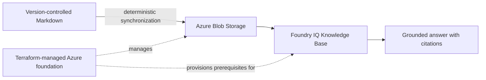

# Architecture

This page describes the target boundaries and the only data path that is currently authorized for implementation. It is an architecture index, not evidence that the target system exists.

## MVP Data Path

The first milestone is intentionally narrow:

`version-controlled Markdown -> Blob Storage -> Foundry IQ Knowledge Base -> cited retrieval result`

Terraform manages the Azure environment around this path. Foundry IQ owns retrieval intelligence. Do not add custom retrieval orchestration in the MVP.

## Target Layers

| Layer | Intended role | Status |
| --- | --- | --- |
| Knowledge source | Version-controlled Markdown in Blob Storage | Phase 2 target |
| Retrieval intelligence | Foundry IQ Knowledge Base and citations | Phase 2 target; verify current API behavior |
| Agent | Foundry Agent Service | Future, blocked until Phase 2 acceptance |
| Application gateway | Python/FastAPI | Future, blocked until Phase 2 acceptance |
| User interface | Next.js/TypeScript | Future, blocked until Phase 2 acceptance |
| Runtime tools | Governed MCP tools | Future, blocked until Phase 2 acceptance |
| Observability | OpenTelemetry and Azure-native diagnostics as verified | Future, blocked until Phase 2 acceptance |
| Evaluation | Grounding, relevance, citation, cost, latency, and regression evidence | Future, blocked until Phase 2 acceptance |
| Additional source | SharePoint | Late Phase 15 only |

## Boundary Rules

- Azure AI Search may be part of the verified Foundry IQ implementation boundary, but the MVP must not bypass Foundry IQ with custom retrieval orchestration.
- Terraform is the infrastructure source of truth.
- Components labeled future are not implemented by this repository bootstrap.
- Foundry IQ and related Foundry APIs may be preview/evolving. Before implementation, record the checked Microsoft documentation, API/SDK versions, region assumptions, and unresolved limitations.
- A diagram is accepted only when it reflects verified repository/service evidence; see [`../diagrams/README.md`](../diagrams/README.md).

## Verification Questions

Before calling Phase 2 complete, answer all of these with evidence:

- Which exact Markdown revision was synchronized?
- Which Blob object or path represents it?
- Which Foundry IQ Knowledge Base consumed the Blob source?
- Did the retrieval answer cite the expected source?
- What version/API assumptions and preview limitations were recorded?
- Can the path be rerun without manual, undocumented portal changes?
