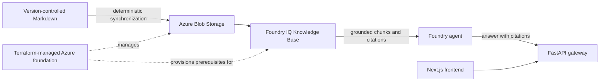

# Architecture

This page is the architecture index: the accepted data path and the layer boundaries. Implementation status is recorded in the roadmap and the acceptance records in [`../verification/`](../verification/).

## MVP Data Path

The MVP data path is:

`version-controlled Markdown -> Blob Storage -> Foundry IQ Knowledge Base -> grounded answer with citations -> FastAPI gateway -> Next.js frontend`

Terraform manages the Azure environment around this path. Foundry IQ owns retrieval intelligence. Do not add custom retrieval orchestration in the MVP.

## Target Layers

| Layer | Intended role | Status |
| --- | --- | --- |
| Knowledge source | Version-controlled Markdown in Blob Storage | Implemented; Phase 2 accepted |
| Retrieval intelligence | Foundry IQ Knowledge Base and citations | Implemented; Phase 2 accepted |
| Agent | Foundry Agent Service | Implemented; Phase 3 accepted |
| Application gateway | Python/FastAPI | Implemented; Phase 4 accepted |
| User interface | Next.js/TypeScript | Implemented; Phase 5 accepted |
| Runtime tools | Governed MCP tools | Planned; post-MVP |
| Observability | OpenTelemetry and Azure-native diagnostics as verified | Planned; post-MVP |
| Evaluation | Grounding, relevance, citation, cost, latency, and regression evidence | Planned; post-MVP |
| Additional source | SharePoint | Planned; Phase 15 only |

## Boundary Rules

- Azure AI Search may be part of the verified Foundry IQ implementation boundary, but the MVP must not bypass Foundry IQ with custom retrieval orchestration.
- Terraform is the infrastructure source of truth.
- Components labeled planned are post-MVP and not implemented; see [`../development-roadmap.md`](../development-roadmap.md) for phase status and [`../verification/`](../verification/) for accepted evidence.
- Foundry IQ and related Foundry APIs may be preview/evolving. Before implementation, record the checked Microsoft documentation, API/SDK versions, region assumptions, and unresolved limitations.
- A diagram is accepted only when it reflects verified repository/service evidence; see [`../diagrams/README.md`](../diagrams/README.md).

## Verification Questions

Phase 2 acceptance required answers to these with evidence; they remain the check for any change to the retrieval path:

- Which exact Markdown revision was synchronized?
- Which Blob object or path represents it?
- Which Foundry IQ Knowledge Base consumed the Blob source?
- Did the retrieval answer cite the expected source?
- What version/API assumptions and preview limitations were recorded?
- Can the path be rerun without manual, undocumented portal changes?
